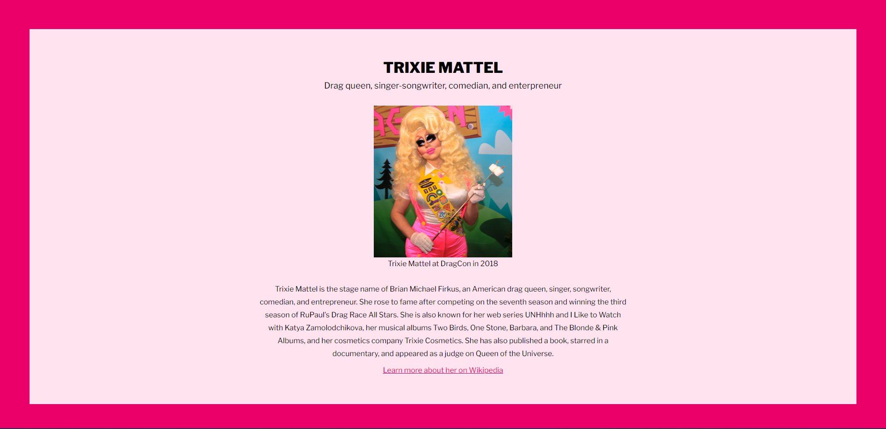

# Tribute Page ✨

**[You can find the live website here.](https://firebreather65.github.io/fcc-tribute-page/)**

## Inspiration
This is my submission for freeCodeCamp's [Tribute Page certification project](https://www.freecodecamp.org/learn/2022/responsive-web-design/build-a-tribute-page-project/build-a-tribute-page)! I chose to honor Trixie Mattel because I honestly look up to her and love her confidence, style, and humor.

## Features
This is a fully responsive website. The color scheme was inspired by Trixie's pink and blonde style.

## Technologies
This website was built purely with HTML and CSS.

## Challenges and accomplishments
I struggled with making the site responsive, especially regarding the image. I did finally make it responsive, though! 😁

## What I learned
Although I didn't learn much coding-wise during this project, I did try out a different design style for this project, which I'm very proud of 🙂

## Future plans
I'd love to also honor Trixie's partner in comedy, Katya Zamolodchikova. I have an idea about making a light/dark mode to showcase both of them.